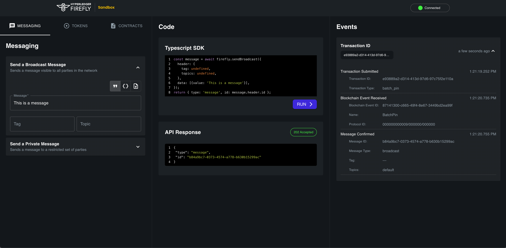

# FireFly Sandbox


[](https://hyperledger.github.io/firefly//)


This is an API exerciser and prototyping tool for applications that communicate with FireFly.

### Dashboard



## Running with CLI

As of v0.0.47 of the [firefly-cli](https://github.com/hyperledger/firefly-cli), one instance
of the sandbox will be started by default for each member of your local FireFly network.
Simply initialize a new stack with the default parameters, and you'll be able to explore and
exercise it using the sandbox.

## Running manually

To run the application manually, start the server and the UI:

```
cd server
npm install
npm run start:dev
```

```
cd ui
npm install
npm start
```

Note: If your Firefly instance is not exposed on port 5000 locally or running remotely, set the env FF_ENDPOINT to the location of your instance.

## Git repositories

There are multiple Git repos making up the Hyperledger FireFly project. Some others
that may be helpful to reference:

- Core - https://github.com/hyperledger/firefly
- Command Line Interface (CLI) - https://github.com/hyperledger/firefly-cli
- FireFly Node.js SDK - https://github.com/hyperledger/firefly-sdk-nodejs

## Contributing

Interested in contributing to the community?

Check out our [Contributor Guide](https://hyperledger.github.io/firefly/contributors/contributors.html), and welcome!

Please adhere to this project's [Code of Conduct](CODE_OF_CONDUCT.md).

## License

Hyperledger Project source code files are made available under the Apache License, Version 2.0 (Apache-2.0), located in the [LICENSE](LICENSE) file.